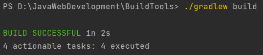
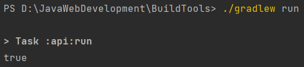

## Build tools (Gradle)
✅ Task 1: Install Gradle \
✅ Task 2: Assemble custom jar `utils-1.3.5.jar`

<b>Note:</b> created archive can be found in `libs` folder.

✅ Task 3: Create a project `multi-project`

